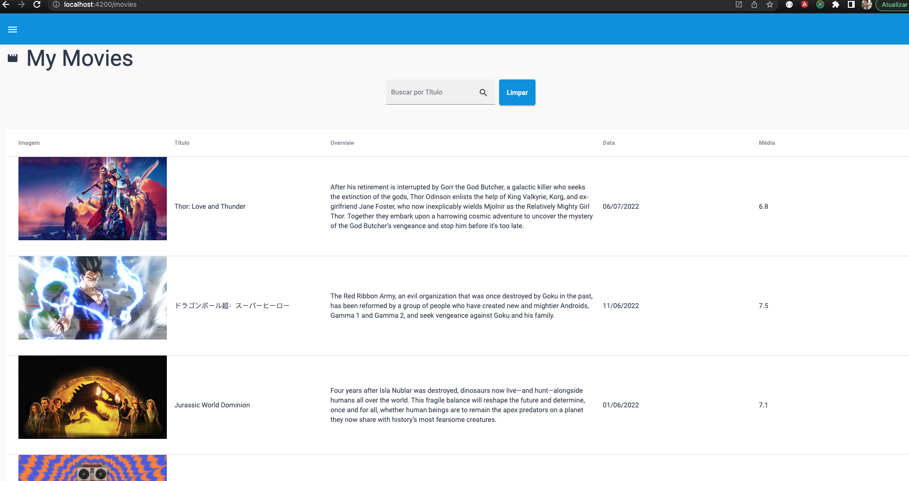
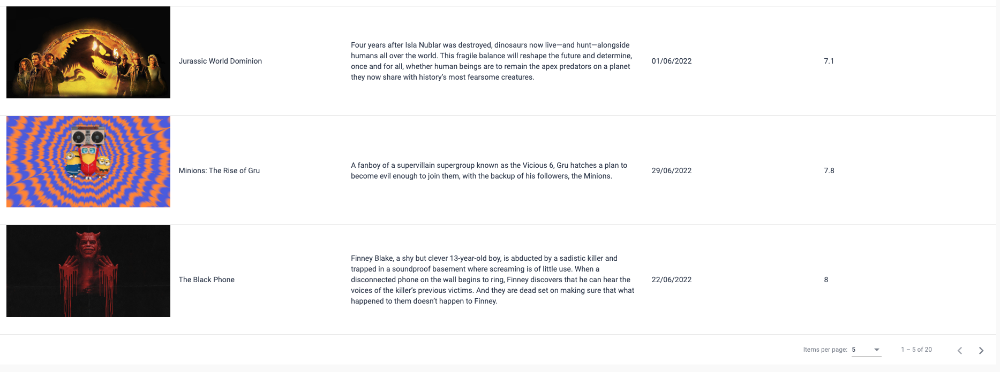
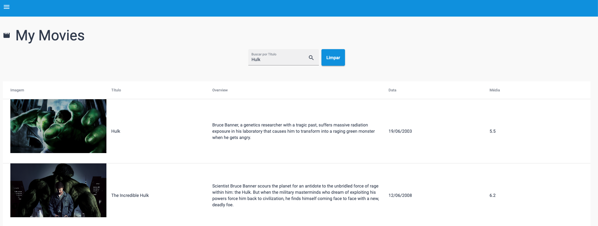
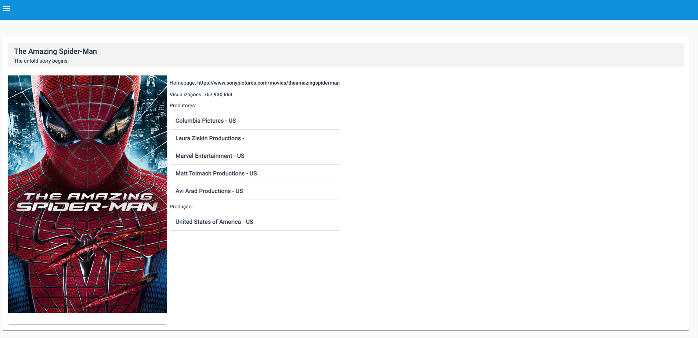
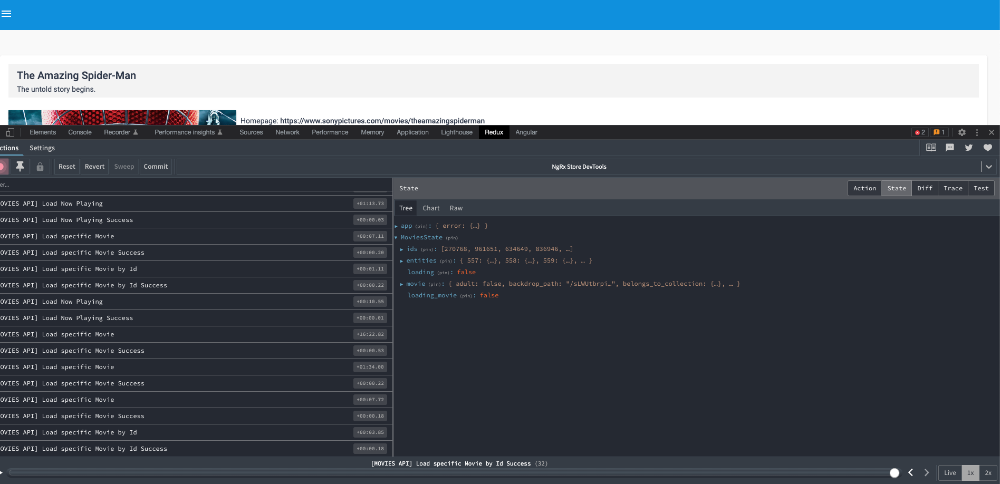
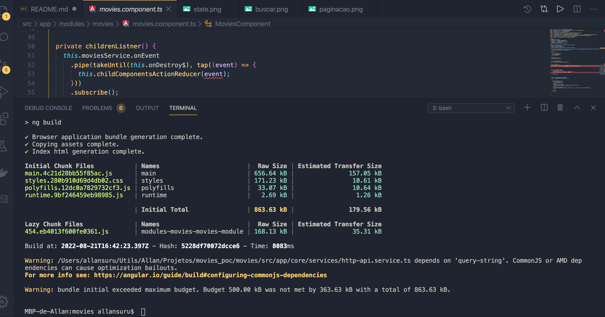

# Movies

This project was generated with [Angular CLI](https://github.com/angular/angular-cli) version 14.0.2.

## Development server

Run `ng serve` for a dev server. Navigate to `http://localhost:4200/`. The application will automatically reload if you change any of the source files.

# Observações!!!!

1 - Utilizei alguns padrões de projeto, como redux pattern, dummy components e event bus communication.

2 - fazer checkout para branch "develop"

## Telas

My Movies - Home

My Movies - Paginação

Buscando Por título

Detalhes do movie

## State

## Build

